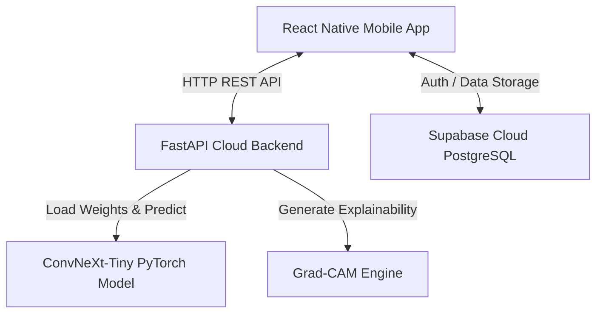

# 📖 LeafDoc - Final Year Project (FYP) Viva Defense Guide

Welcome to your ultimate defense guide for **LeafDoc**! This document is designed to give you a deep, clear understanding of your entire project so you can confidently face any question from your external examiners.

---

## 🗺️ 1. System Architecture & Data Flow

When the examiner asks: *"Explain the architecture of your system and how data flows from the phone to the backend,"* use this explanation.

### High-Level Architecture Diagram


### The Step-by-Step Data Flow
1. **User Action:** The user snaps a photo of a diseased leaf using the React Native app.
2. **Backend Upload:** The app sends the raw image via an `HTTP POST` request to the FastAPI backend endpoint `/predict`.
3. **AI Inference:** The FastAPI server receives the image, resizes it to $224 \times 224$ pixels, converts it to a PyTorch tensor, and feeds it into the **ConvNeXt-Tiny** Deep Learning model.
4. **Grad-CAM Processing:** While classifying, the server runs the **Grad-CAM** algorithm to extract heatmaps showing exactly which visual patterns (spots, lesions, veins) the model focused on.
5. **JSON Response:** The backend returns a JSON response containing:
   - The predicted **crop name** and **disease class**.
   - The **confidence percentage** (e.g., $94.2\%$).
   - A base64-encoded **Grad-CAM visual overlay** showing the heatmap.
   - Comprehensive **disease information** (symptoms, organic control, chemical control).
6. **Supabase Sync:** The mobile app displays this result instantly. If the user taps **Save to History**, the scan details and classification are written to your secure **Supabase PostgreSQL** cloud database.

---

## 🧠 2. Deep Learning & Computer Vision (The Backend)

Examiners love digging into the AI model. Be prepared for these core topics:

### What is ConvNeXt?
*   **Definition:** ConvNeXt is a modern Convolutional Neural Network (CNN) architecture introduced by Meta AI.
*   **Why ConvNeXt over ResNet or MobileNet?** ConvNeXt "modernizes" traditional CNNs by borrowing design principles from Vision Transformers (ViTs)—such as larger kernel sizes ($7\times7$), inverted bottlenecks, and layer normalization instead of batch normalization. It achieves higher accuracy while maintaining the speed and low memory footprint of a standard CNN.

### What is Grad-CAM?
*   **Definition:** Gradient-weighted Class Activation Mapping.
*   **Why use it?** Deep learning models are traditionally "black boxes" (we don't know *why* they make a decision). Grad-CAM provides **explainability** by looking at the gradients flowing into the final convolutional layer. It generates a heatmap highlighting the exact spot on the leaf that triggered the classification (e.g., yellow spots on a tomato leaf).

---

## 📱 3. Mobile Application (The Frontend)

Your mobile app is built using **React Native** and **Expo**. Here is the key structural knowledge:

### Core Screens & Components
*   [App.js](file:///c:/Users/user/Desktop/plant-disease-app/frontend/App.js): Configures your app's main navigation container (Stack & Tab navigation) and holds global state providers.
*   [HomeScreen.js](file:///c:/Users/user/Desktop/plant-disease-app/frontend/src/screens/HomeScreen.js): Displays local weather, spray recommendations, recent scan history, and general agricultural alerts.
*   [ScanScreen.js](file:///c:/Users/user/Desktop/plant-disease-app/frontend/src/screens/ScanScreen.js): Controls the device camera, allows users to choose images from the gallery, and manages image uploads.
*   [ResultScreen.js](file:///c:/Users/user/Desktop/plant-disease-app/frontend/src/screens/ResultScreen.js): Displays the Grad-CAM heatmap, classification metrics, and detailed disease treatments.
*   [WeatherAdvisoryScreen.js](file:///c:/Users/user/Desktop/plant-disease-app/frontend/src/screens/WeatherAdvisoryScreen.js): Calculates whether wind, humidity, and temperature conditions are safe for spraying pesticides (spray advisory logic).

---

## 🗄️ 4. Database & Backend Configuration (Supabase)

Your database structure is clean, secure, and professional. 

*   [database_schema.sql](file:///c:/Users/user/Desktop/plant-disease-app/database_schema.sql): Defines the tables in PostgreSQL.
    -   `users`: Stores profile information (`id`, `full_name`, `expo_push_token`).
    -   `scans`: Stores individual diagnoses (`id`, `user_id`, `crop`, `disease`, `confidence`, `image_url`, `created_at`).
*   **Authentication:** Managed via **Supabase Auth** (JWT-based session tokens). When users sign up or log in, Supabase securely creates the session.
*   **Password Reset Flow:** Uses `supabase.auth.resetPasswordForEmail()`. It sends a secure, short-lived reset link directly to the user's email inbox.

---

## 💬 5. Rapid-Fire Viva Q&A (Most Likely Questions)

Use these short, direct answers when being questioned:

#### Q1: "Why did you use FastAPI instead of Flask or Django?"
> *"FastAPI is built on modern asynchronous standards (ASGI), making it significantly faster than Flask. It also generates automatic Swagger API documentation and supports native Pydantic data validation, which makes receiving and validating leaf image data completely secure and robust."*

#### Q2: "How does your app secure user credentials?"
> *"I use Supabase Auth, which implements industry-standard PostgreSQL security policies. Passwords are encrypted on Supabase's cloud servers using bcrypt. The mobile application never stores plain text passwords; it only holds a secure JSON Web Token (JWT) session."*

#### Q3: "Where are the scanned crop images stored?"
> *"Images are stored in two places: locally on the device's cache folder for instant offline rendering, and uploaded to a secure Supabase Storage bucket for persistent cloud backup in the user's scan history."*

#### Q4: "What is the purpose of `.env` files and why are they ignored by Git?"
> *"`.env` files store private environment variables like database passwords and API keys. They are explicitly excluded via `.gitignore` to prevent leaking sensitive security credentials to public GitHub repositories."*

#### Q5: "How does the Weather Spray Advisory logic work?"
> *"The app fetches live weather data (temperature, wind speed, precipitation probability). It checks these values against agricultural standards: spraying is advised against if the wind speed is too high (causes spray drift), if it is raining (washes chemicals away), or if the temperature is extremely high (causes evaporation)."*

---

## 🏆 6. How to Run & Present the App Live

If they ask you to run the app from scratch, execute these commands:

1.  **Start Backend (Python):**
    ```bash
    cd backend
    uvicorn main:app --reload
    ```
2.  **Start Frontend (React Native):**
    ```bash
    cd frontend
    npx expo start
    ```
3.  **Use the App:** Open the Expo Go app on your phone, scan the QR code in the terminal, and watch the app boot instantly.
